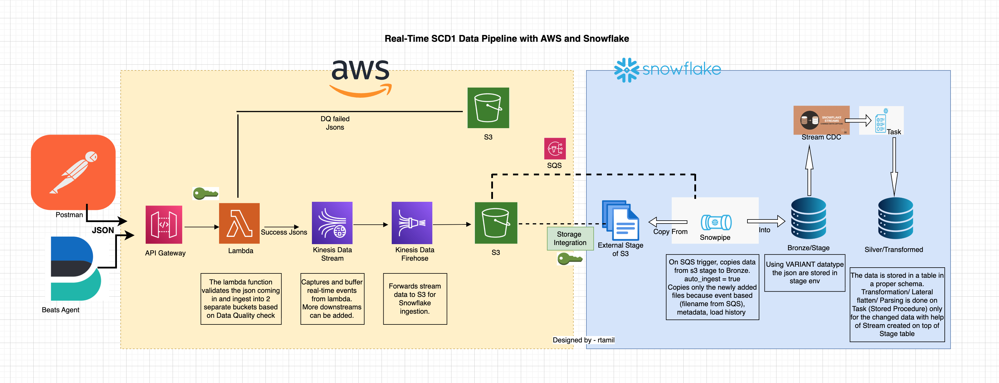

# real_time_stream_scd1_aws_snowflake
This proof of concept (POC) explores a scalable log ingestion pipeline using AWS and Snowflake as an alternative to a traditional Beats/Logstash/Kafka/OpenSearch flow.

The goal was to design a pipeline that can take log events from Beats Agent, validate them through API Gateway and Lambda, and then move them through Kinesis Data Streams and Kinesis Firehose into S3. From there, Snowpipe picks up the new files from the external stage and loads them into Snowflake, where Stream and Task-based CDC processing helps transform the data further.

This architecture demonstrates how logs can be ingested in a scalable and near real-time manner while keeping each layer simple and purpose-driven.

Key aspects of this design include:
- Lambda handles validation and data quality checks.
- Kinesis supports real-time buffering and delivery.
- S3 acts as the landing zone.
- Snowpipe automates ingestion into Snowflake.
- Streams and Tasks manage incremental transformations.

This serves as a strong example of how AWS and Snowflake can collaborate for log ingestion, particularly when aiming for a clean layered design with built-in automation. 
